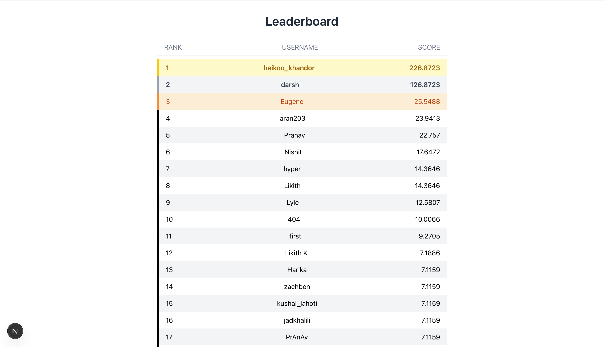

# Aggie Data Science Club Competition Website For Leaderboards

<p align="center">
    
</p>

This was used for 04/22/2025 <a href="https://website-app-463097328737.us-south1.run.app"  target="_blank" rel="noopener noreferrer">Aggie Data Science</a> Workshop over Time Series Data. Students were given time series data and had to use some time series forecasting machine learning models (LSTM, Winter's Method, ARIMA, SARIMA, etc.). 

The tech stack is FastAPI and Python for the backend, PostgreSQL and Supabase for the database, and NextJS and React for the frontend.
Users will submit their model predictions to the leaderboard website API, the API will compare the results to the true labels, and the results will be displayed on the leaderboard.

# Connecting to Leaderboard
```python
    import requests
    url = "https://adsc-competition-website.onrender.com/signup" # deployed on render
    
    user_data = {
        "name": "PrAnAv",
        "password": "1235" # must be numerical
    }
    response = requests.post(url, json=user_data)
```

# Sending Data to Leaderboard
```python
    import requests
    import json
    
    url = "https://adsc-competition-website.onrender.com/verifyAnswers"
    # User authentication details (to be sent in the JSON body)
    user_data = {
        "name": "PrAnAv",
        "password": "1235"
    }
    user_data_str = json.dumps(user_data)
    
    # Open model predictions file to upload
    files = {
        'file': open(SRC_PATH + 'predictions.csv', 'rb')
    }
    
    # Send POST request
    response = requests.post(url, data={'data': user_data_str}, files=files)
```
